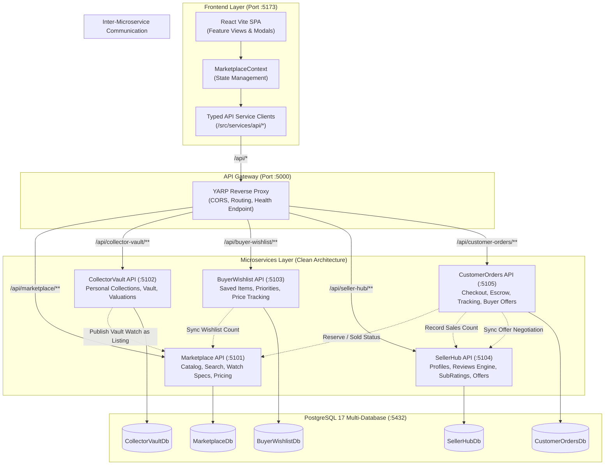

# Current ongoing dev: Connecting Frontend with Backend Microservices via API Gateway

This plan details how we will connect the React frontend to the 5 isolated microservices through the YARP API Gateway, expose comprehensive REST endpoints in each microservice, establish inter-microservice communication with clear service boundaries, and provide a resilient developer experience with real-time connection status.

---

## 1. System Architecture & Service Boundaries

### Bounded Contexts & Service Boundaries

| Service | Bounded Context Responsibility | Owned Entities | Port | Database |
| :--- | :--- | :--- | :--- | :--- |
| **Marketplace** | Public catalog, search/filter, watch specifications, pricing, inventory/listing status, views, wishlist counts. | `WatchListing` | `5101` | `MarketplaceDb` |
| **CollectorVault** | Personal watch vault, serial numbers, private purchase history, valuations, and orchestrating "list for sale". | `VaultWatch`, `ValuationRecord` | `5102` | `CollectorVaultDb` |
| **BuyerWishlist** | Saved items, priority tags (`High`, `Medium`, `Low`), price-when-added tracking, personal notes. | `WishlistItem` | `5103` | `BuyerWishlistDb` |
| **SellerHub** | Dealer & seller profiles, reviews with 4-pillar `ReviewSubRatings` (accuracy, communication, shipping, authenticity), seller offer inbox. | `SellerProfile`, `SellerReview`, `SellerOfferNegotiation` | `5104` | `SellerHubDb` |
| **CustomerOrders** | Checkout flow, order state machine (`pending` -> `authenticated` -> `shipped` -> `delivered` -> `completed`), escrow, buyer offers. | `CustomerOrder`, `BuyerOffer` | `5105` | `CustomerOrdersDb` |

---

## 2. Inter-Microservice Communication Design

Microservices must remain autonomous and maintain independent data stores. Cross-service workflows will be implemented via **typed resilient HTTP clients** defined in `BuildingBlocks/MyWatchMarketplace.Contracts`:

1. **`CustomerOrders` &rarr; `Marketplace`**:
   - When an order is placed (`POST /api/customer-orders`), CustomerOrders calls `MarketplaceClient.UpdateListingStatusAsync(listingId, "reserved")`.
   - When order is delivered/completed (`PATCH /api/customer-orders/{id}/status`), CustomerOrders calls `MarketplaceClient.UpdateListingStatusAsync(listingId, "sold")`.
2. **`CustomerOrders` &rarr; `SellerHub`**:
   - When order completes, CustomerOrders calls `SellerHubClient.IncrementSalesCountAsync(sellerId)`.
   - When a buyer submits an offer (`POST /api/customer-orders/offers`), CustomerOrders notifies `SellerHubClient.CreateOfferNegotiationAsync(...)` so the seller sees it in their inbox.
3. **`CollectorVault` &rarr; `Marketplace`**:
   - When a collector clicks "List for Sale" (`POST /api/collector-vault/watches/{id}/list-for-sale`), CollectorVault calls `MarketplaceClient.CreateListingAsync(...)`, links `listingId`, and updates `isListedForSale = true`.
4. **`BuyerWishlist` &rarr; `Marketplace`**:
   - When a buyer adds/removes an item, BuyerWishlist calls `MarketplaceClient.AdjustWishlistCountAsync(listingId, +1 / -1)`.

---

## 3. Proposed Changes

### Component 1: `BuildingBlocks/MyWatchMarketplace.Contracts`
Define shared integration DTOs and typed HTTP client interfaces used for inter-service communication.

#### [NEW] [IMarketplaceClient.cs](file:///C:/Projects/Meridian-watch-marketplace/Meridian-watch-marketplace/backend/BuildingBlocks/MyWatchMarketplace.Contracts/Clients/IMarketplaceClient.cs)
- `UpdateListingStatusAsync(string listingId, string status)`
- `AdjustWishlistCountAsync(string listingId, int delta)`
- `CreateListingFromVaultAsync(CreateListingRequest request)`

#### [NEW] [ISellerHubClient.cs](file:///C:/Projects/Meridian-watch-marketplace/Meridian-watch-marketplace/backend/BuildingBlocks/MyWatchMarketplace.Contracts/Clients/ISellerHubClient.cs)
- `IncrementSalesCountAsync(string sellerId)`
- `SyncOfferToSellerAsync(SyncOfferRequest request)`
- `UpdateOfferStatusAsync(string offerId, string status, decimal? counterAmount)`

#### [NEW] [Contracts DTOs](file:///C:/Projects/Meridian-watch-marketplace/Meridian-watch-marketplace/backend/BuildingBlocks/MyWatchMarketplace.Contracts/DTOs/IntegrationDtos.cs)
- Shared request/response models for cross-service calls.

---

### Component 2: Microservice APIs (Endpoints & Seeding)

#### Marketplace Service (`services/marketplace`)
- **[NEW] [ListingDtos.cs](file:///C:/Projects/Meridian-watch-marketplace/Meridian-watch-marketplace/backend/services/marketplace/MyWatchMarketplace.marketplace.Application/DTOs/ListingDtos.cs)**: DTOs for create, update, filter, status change.
- **[MODIFY] [MarketplaceDbContextInitialiser.cs](file:///C:/Projects/Meridian-watch-marketplace/Meridian-watch-marketplace/backend/services/marketplace/MyWatchMarketplace.marketplace.Infrastructure/Persistence/MarketplaceDbContextInitialiser.cs)**: Seed initial watch catalog (`INITIAL_LISTINGS`).
- **[MODIFY] [Program.cs](file:///C:/Projects/Meridian-watch-marketplace/Meridian-watch-marketplace/backend/services/marketplace/MyWatchMarketplace.marketplace.Api/Program.cs)**:
  - Map endpoints under `/api/marketplace/listings`:
    - `GET /api/marketplace/listings` (search, brand, movement, condition, price range, sort)
    - `GET /api/marketplace/listings/{id}`
    - `POST /api/marketplace/listings`
    - `PUT /api/marketplace/listings/{id}`
    - `DELETE /api/marketplace/listings/{id}`
    - `PATCH /api/marketplace/listings/{id}/status`
    - `POST /api/marketplace/listings/{id}/view`
    - `POST /api/marketplace/listings/{id}/wishlist-delta`
  - Enable CORS & configure port `5101`.

#### CollectorVault Service (`services/CollectorVault`)
- **[NEW] [VaultDtos.cs](file:///C:/Projects/Meridian-watch-marketplace/Meridian-watch-marketplace/backend/services/CollectorVault/MyWatchMarketplace.CollectorVault.Application/DTOs/VaultDtos.cs)**: DTOs for collection watches, valuations, listing.
- **[MODIFY] [CollectorVaultDbContextInitialiser.cs](file:///C:/Projects/Meridian-watch-marketplace/Meridian-watch-marketplace/backend/services/CollectorVault/MyWatchMarketplace.CollectorVault.Infrastructure/Persistence/CollectorVaultDbContextInitialiser.cs)**: Seed initial vault items.
- **[MODIFY] [Program.cs](file:///C:/Projects/Meridian-watch-marketplace/Meridian-watch-marketplace/backend/services/CollectorVault/MyWatchMarketplace.CollectorVault.Api/Program.cs)**:
  - Map endpoints under `/api/collector-vault/watches`:
    - `GET /api/collector-vault/watches?userId={userId}`
    - `GET /api/collector-vault/watches/{id}`
    - `POST /api/collector-vault/watches`
    - `PUT /api/collector-vault/watches/{id}`
    - `DELETE /api/collector-vault/watches/{id}`
    - `POST /api/collector-vault/watches/{id}/valuations`
    - `GET /api/collector-vault/watches/{id}/valuations`
    - `POST /api/collector-vault/watches/{id}/list-for-sale` (calls Marketplace client)
    - `POST /api/collector-vault/watches/{id}/unlink-listing`
  - Configure port `5102`.

#### BuyerWishlist Service (`services/BuyerWishlist`)
- **[NEW] [WishlistDtos.cs](file:///C:/Projects/Meridian-watch-marketplace/Meridian-watch-marketplace/backend/services/BuyerWishlist/MyWatchMarketplace.BuyerWishlist.Application/DTOs/WishlistDtos.cs)**: DTOs for wishlist items and updates.
- **[MODIFY] [BuyerWishlistDbContextInitialiser.cs](file:///C:/Projects/Meridian-watch-marketplace/Meridian-watch-marketplace/backend/services/BuyerWishlist/MyWatchMarketplace.BuyerWishlist.Infrastructure/Persistence/BuyerWishlistDbContextInitialiser.cs)**: Seed initial wishlist.
- **[MODIFY] [Program.cs](file:///C:/Projects/Meridian-watch-marketplace/Meridian-watch-marketplace/backend/services/BuyerWishlist/MyWatchMarketplace.BuyerWishlist.Api/Program.cs)**:
  - Map endpoints under `/api/buyer-wishlist`:
    - `GET /api/buyer-wishlist?buyerId={buyerId}`
    - `GET /api/buyer-wishlist/check?buyerId={buyerId}&listingId={listingId}`
    - `POST /api/buyer-wishlist` (syncs Marketplace wishlist count)
    - `DELETE /api/buyer-wishlist/{listingId}?buyerId={buyerId}` (syncs Marketplace)
    - `DELETE /api/buyer-wishlist/clear?buyerId={buyerId}`
    - `PUT /api/buyer-wishlist/{id}/notes`
  - Configure port `5103`.

#### SellerHub Service (`services/SellerHub`)
- **[NEW] [SellerHubDtos.cs](file:///C:/Projects/Meridian-watch-marketplace/Meridian-watch-marketplace/backend/services/SellerHub/MyWatchMarketplace.SellerHub.Application/DTOs/SellerHubDtos.cs)**: DTOs for profiles, reviews, sub-ratings, offers.
- **[MODIFY] [SellerHubDbContextInitialiser.cs](file:///C:/Projects/Meridian-watch-marketplace/Meridian-watch-marketplace/backend/services/SellerHub/MyWatchMarketplace.SellerHub.Infrastructure/Persistence/SellerHubDbContextInitialiser.cs)**: Seed initial profiles and reviews.
- **[MODIFY] [Program.cs](file:///C:/Projects/Meridian-watch-marketplace/Meridian-watch-marketplace/backend/services/SellerHub/MyWatchMarketplace.SellerHub.Api/Program.cs)**:
  - Map endpoints under `/api/seller-hub`:
    - `GET /api/seller-hub/profiles`
    - `GET /api/seller-hub/profiles/{userId}`
    - `PUT /api/seller-hub/profiles/{userId}`
    - `GET /api/seller-hub/reviews?sellerId={sellerId}`
    - `POST /api/seller-hub/reviews` (recalculates profile average)
    - `POST /api/seller-hub/reviews/{reviewId}/reply`
    - `GET /api/seller-hub/offers?sellerId={sellerId}`
    - `PATCH /api/seller-hub/offers/{offerId}/respond`
  - Configure port `5104`.

#### CustomerOrders Service (`services/CustomerOrders`)
- **[NEW] [OrderDtos.cs](file:///C:/Projects/Meridian-watch-marketplace/Meridian-watch-marketplace/backend/services/CustomerOrders/MyWatchMarketplace.CustomerOrders.Application/DTOs/OrderDtos.cs)**: DTOs for orders, offers, status transitions.
- **[MODIFY] [CustomerOrdersDbContextInitialiser.cs](file:///C:/Projects/Meridian-watch-marketplace/Meridian-watch-marketplace/backend/services/CustomerOrders/MyWatchMarketplace.CustomerOrders.Infrastructure/Persistence/CustomerOrdersDbContextInitialiser.cs)**: Seed initial orders.
- **[MODIFY] [Program.cs](file:///C:/Projects/Meridian-watch-marketplace/Meridian-watch-marketplace/backend/services/CustomerOrders/MyWatchMarketplace.CustomerOrders.Api/Program.cs)**:
  - Map endpoints under `/api/customer-orders`:
    - `GET /api/customer-orders?userId={userId}&role={buyer|seller}`
    - `GET /api/customer-orders/{id}`
    - `POST /api/customer-orders` (reserves listing in Marketplace)
    - `PATCH /api/customer-orders/{id}/status` (marks sold in Marketplace upon completion, records sale in SellerHub)
    - `GET /api/customer-orders/offers?buyerId={buyerId}`
    - `POST /api/customer-orders/offers` (notifies SellerHub)
    - `PATCH /api/customer-orders/offers/{offerId}/respond`
  - Configure port `5105`.

---

### Component 3: API Gateway (`backend/gateway/MyWatchMarketplace.ApiGateway`)
- **[MODIFY] [appsettings.json](file:///C:/Projects/Meridian-watch-marketplace/Meridian-watch-marketplace/backend/gateway/MyWatchMarketplace.ApiGateway/appsettings.json)**:
  - Verify clusters point to `http://localhost:5101` through `5105`.
  - Add `/health` aggregation and CORS support for `http://localhost:5173`.
- **[MODIFY] [Properties/launchSettings.json](file:///C:/Projects/Meridian-watch-marketplace/Meridian-watch-marketplace/backend/gateway/MyWatchMarketplace.ApiGateway/Properties/launchSettings.json)**:
  - Set gateway application URL to `http://localhost:5000`.

---

### Component 4: Frontend API Layer & Context Integration
- **[NEW] [client.ts](file:///C:/Projects/Meridian-watch-marketplace/Meridian-watch-marketplace/frontend/src/services/api/client.ts)**:
  - Base fetch client targeting Gateway `http://localhost:5000`.
  - Handles JSON headers, query params, error parsing, and connectivity detection.
- **[NEW] [marketplaceApi.ts](file:///C:/Projects/Meridian-watch-marketplace/Meridian-watch-marketplace/frontend/src/services/api/marketplaceApi.ts)**: Calls `/api/marketplace/...`.
- **[NEW] [collectorVaultApi.ts](file:///C:/Projects/Meridian-watch-marketplace/Meridian-watch-marketplace/frontend/src/services/api/collectorVaultApi.ts)**: Calls `/api/collector-vault/...`.
- **[NEW] [buyerWishlistApi.ts](file:///C:/Projects/Meridian-watch-marketplace/Meridian-watch-marketplace/frontend/src/services/api/buyerWishlistApi.ts)**: Calls `/api/buyer-wishlist/...`.
- **[NEW] [sellerHubApi.ts](file:///C:/Projects/Meridian-watch-marketplace/Meridian-watch-marketplace/frontend/src/services/api/sellerHubApi.ts)**: Calls `/api/seller-hub/...`.
- **[NEW] [customerOrdersApi.ts](file:///C:/Projects/Meridian-watch-marketplace/Meridian-watch-marketplace/frontend/src/services/api/customerOrdersApi.ts)**: Calls `/api/customer-orders/...`.
- **[MODIFY] [MarketplaceContext.tsx](file:///C:/Projects/Meridian-watch-marketplace/Meridian-watch-marketplace/frontend/src/context/MarketplaceContext.tsx)**:
  - Replaces purely local mock actions with calls to the respective API services.
  - On mount, fetches listings, collections, wishlists, reviews, profiles, and orders through API Gateway.
  - Keeps graceful fallback to local storage / initial seed if backend gateway is offline, ensuring the frontend never breaks.
  - Tracks `isGatewayConnected` boolean state.
- **[MODIFY] [Header.tsx](file:///C:/Projects/Meridian-watch-marketplace/Meridian-watch-marketplace/frontend/src/components/Header.tsx)**:
  - Add visual status pill in the header banner: `🟢 API Gateway (:5000) Connected` or `🟡 Local Cache Mode`.
- **[MODIFY] [vite.config.ts](file:///C:/Projects/Meridian-watch-marketplace/Meridian-watch-marketplace/frontend/vite.config.ts)**:
  - Add proxy config for `/api` forwarding to `http://localhost:5000`.

---

## 4. Verification Plan

### Automated Build Verification
1. `dotnet build backend/MyWatchMarketplace.sln`:
   - Verify 0 errors, 0 warnings across all 23 projects.
2. `npm run build` (in `frontend`):
   - Verify TypeScript compilation and Vite production build pass with 0 errors.

### Functional Endpoint & Gateway Verification
1. Test Gateway Health:
   - `Invoke-RestMethod http://localhost:5000/health`
2. Test Gateway Routing to Microservices:
   - `GET http://localhost:5000/api/marketplace/listings`
   - `GET http://localhost:5000/api/collector-vault/watches?userId=user-current-seller`
   - `GET http://localhost:5000/api/buyer-wishlist?buyerId=user-current-buyer`
   - `GET http://localhost:5000/api/seller-hub/profiles`
   - `GET http://localhost:5000/api/customer-orders?userId=user-current-buyer`
3. Test Cross-Service Workflow:
   - Placing an order via CustomerOrders API verifies listing status in Marketplace changes to `reserved`.
   - Adding a wishlist item via BuyerWishlist API verifies wishlist count in Marketplace increments.
4. Verify Frontend:
   - Load frontend in browser at `http://localhost:5173`.
   - Confirm Header reflects API Gateway connection.
   - Verify filtering/searching listings, toggling wishlist, viewing vault, placing order, and submitting review all call their respective microservice through the gateway.
